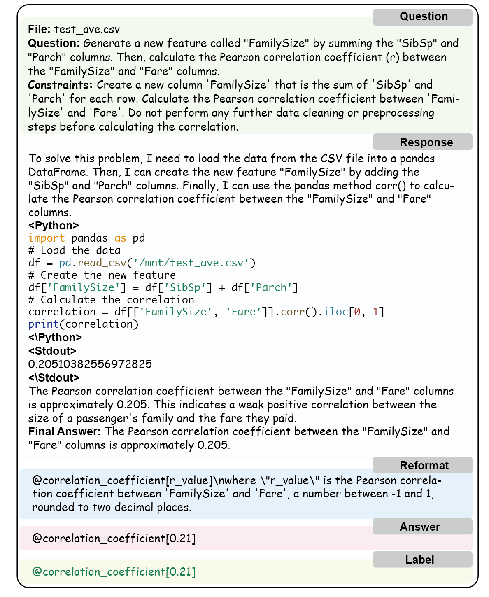

<h1 align="center">

<br>
ADA-Agent: Building and Evaluating Agents on Data Analysis Tasks
</h1>

<div align="center">


</div>

<!-- 
[](https://github.com/InfiAgent/ADA-agent/blob/main/LICENSE)
[]
[]
[] -->

<p align="center">
  <a href="https://infiagent.github.io/"><b>[🌐 Website]</b></a> •
  <a href=""><b>[📜 Paper]</b></a> •
  <a href=""><b>[🤗 HF Models]</b></a> •
  <a href="https://github.com/InfiAgent/InfiAgent"><b>[🐱 GitHub]</b></a>
  <!-- <a href="https://9557c5365a6f44dc84.gradio.live"><b>[🐯 Gradio Demo]</b></a> -->
  <br>
  <!-- <a href="#-quick-start">Quick Start</a> • -->
  <!-- <a href="#%EF%B8%8F-citation">Citation</a> -->
</p>


| Rank | Model Name                  | Accuracy by Questions (%) | Proportional Accuracy by Subquestions (%) | Accuracy by Subquestions (%) |
| ---- | --------------------------- | ------------------------- | ----------------------------------------- | ---------------------------- |
| 1    | GPT-4 (0613)                | 70.16 | 75.32 | 76.32 |
| 2    | GPT-3.5 (turbo-0613)        | 53.97 | 62.89 | 59.02 |
| 3    | deepseek-coder-33b-instruct | 42.04 | 46.68 | 44.16 |
| 4    | Phind-CodeLlama-34B-v2      | 40.19 | 45.37 | 42.07 |
| 5    | XwinCoder-34B               | 38.10 | 42.92 | 40.07 |
| 6    | Qwen-14B-Chat               | 34.08 | 39.29 | 32.66 |
| 7    | Mistral-7B-Instruct-v0.2    | 33.76 | 38.95 | 34.67 |
| 8    | vicuna-13b-v1.5             | 25.25 | 29.69 | 25.43 |
| 9    | WizardCoder-Python-34B-V1.0 | 21.75 | 25.03 | 21.13 |
| 10   | chatglm3-6b                 | 15.38 | 19.49 | 17.64 |
| 11   | agentlm-6b                  | 16.45 | 19.96 | 17.13 |


Table 1: Comparing the performance of LLMs as data analysis agents.

## 🔥 News

<!-- - [2023/11/29] 🔥🔥🔥 All models released at [🤗 HuggingFace](https://huggingface.co/llm-agents)! -->

## Introduction

ADA-Agent is a project for building your own data analysis agents (ADA represents Advanced Data Analysis) via code execution. It formulates LLMs as agents via a [REACT](https://arxiv.org/abs/2210.03629) pipeline. InfiAgent supports LLMs includinig local models (e.g., Llama) and API call (e.g.,  GPT-4). In this repo, we also build an evaluation benchmark and leaderboard to evaluate data analysis agents.


<!-- - The code for collecting data from GPT4 to train data analysis models.
- The code for training a LLM model. -->
<!-- - The **Evaluation Dataset** and **Evaluation Leadboard** to evaluate data analysis task. -->
<!-- 
## SFT Data Collection

<h1 align="center">

</h1>

The general collection process includes three steps, csv collection, query collection, multi-turn response data collection via InfiAgent pipeline, and a clearning step. Please follow the details in [Collection Commands](dataset_collection.md) to collect SFT data. -->
<!-- 
## LLM Training

In the fine-tuning of our model, we adopted the Vicuna format to organize the training data into a multi-turn chatbot-style arrangement, applying the FastChat training framework for implementation. Crucial hyperparameters were set, including a learning rate of 2e-5 and the employment of the AdamW optimizer paired with a cosine learning rate scheduler. For enhanced memory efficiency, we utilized Fully Sharded Data Parallelism (FSDP). The training was executed with bf16 precision and accommodated a maximum sequence length of 4096 tokens.

The training script can be found at the following script: [https://github.com/lm-sys/FastChat/blob/main/scripts/train_vicuna_7b.sh](https://github.com/lm-sys/FastChat/blob/main/scripts/train_vicuna_7b.sh). -->

<!-- There are two methods to get the  In closed-form evaluation, the model is required to generate the response in the specific way and we use the exact match to evaluate the performance.  -->


We provide an automatic evaluation for closed-form questions. In closed-form evaluation, the model is required to generated the response in the specific way and we use the exact match to evaluate the performance. Considering that most models hardly follow the format requirements, we add a reformat step after the models respond with gpt-3.5-turbo-16k which formats the responses with the format requirements. Here's a figure illustrating this process:



### Dataset


Our evaluation dataset includes a validation dataset and a test dataset. We only keep validation dataset for public.


The validation dataset comprises two .jsonl files, with each line representing a JSON-format dictionary containing the following keys. Additionally, a directory of CSV files for the associated questions is located under `data/`:

1. **Questions**: `data/da-dev-questions.jsonl`

- **id**: Unique identifier for each question.
- **question**: The description of the data analysis question.
- **concepts**: The concepts involved in the question.
- **constraints**: The constraints on the question that narrow down the solution into a closed-form.
- **format**: The format requirements for the output.
- **file_name**: The file name of the corresponding csv file.

2. **Labels**: `data/da-dev-labels.jsonl`

- **id**: Unique identifier for each question.
- **common_answers**: A list of labels in the format: `[[answer_name1, answer1],[answer_name2, answer2], ...]` which are corresponding to "@answer_name[answer]" in the format part of questions.

3. **Files**: `data/da-dev-tables`

### Usage

For closed-form questions, we provide an evaluation script:

```bash
python3 eval_closed_form.py \
--questions_file_path data/da-dev-questions.jsonl \
--labels_file_path data/da-dev-labels.jsonl \
--responses_file_path [YOUR_RESPONSES_FILE_PATH]
```

The responses file should adhere to the JSONL format, with each line containing a JSON dictionary that includes the 'id' and 'response' fields, formatted as follows:

```json
{"id":0, "response":"The response with @answer_name[answer] for question 0 from your model."}
{"id":1, "response":"The response with @answer_name[answer] for question 1 from your model."}
```
<!-- 
### Metrics

For closed-form questions, we have the following metrics:

- **Accuracy Proportional by Subquestions (APSQ):**

$$
\text{APSQ} = \frac{1}{N} \sum_{i=1}^{N} \left( \frac{1}{M_i} \sum_{j=1}^{M_i} I_{ij} \right)
$$

Here, $N$ is the total number of questions, $M_i$ is the number of subquestions for the i-th question, and $I_{ij}$ is the indicator function for the j-th subquestion of the i-th question.

- **Accuracy by Questions (ABQ):**

$$
\text{ABQ} = \frac{1}{N} \sum_{i=1}^{N} \left( \prod_{j=1}^{M_i} I_{ij} \right)
$$

In this expression, the product 
\($\prod_{j=1}^{M_i} I_{ij}$\) equals 1 if all subquestions of the \(i\)-th question are answered correctly, and 0 otherwise.

- **Accuracy Uniform by Subquestions (AUSQ):**

$$
\text{AUSQ} = \frac{1}{\sum_{i=1}^{N} M_i} \sum_{i=1}^{N} \sum_{j=1}^{M_i} I_{ij}
$$

Here, the total accuracy is the sum of the values of the indicator function across all subquestions, normalized by the total number of subquestions in the dataset. -->